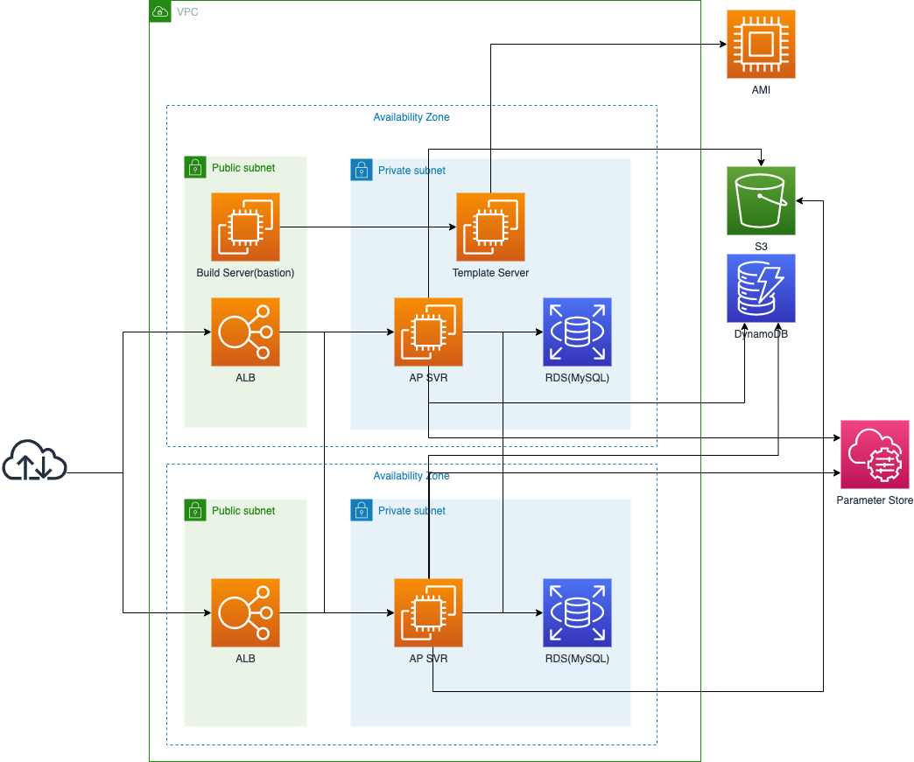

# System structure


~~# IAM Roleを編集する~~  
~~EMR_EC2_DefaultRoleに以下のポリシーを追加する~~

~~* AmazonS3FullAccess~~  
~~* AmazonElasticMapReduceforEC2Role~~  
~~* CloudWatchAgentServerPolicy~~  
~~* CloudWatchFullAccess~~  
~~* AmazonDynamoDBFullAccess~~  
~~* CloudWatchLogsFullAccess~~  
~~* AmazonSSMFullAccess~~

# インフラの構築
1. Cloud 9を立ち上げる

2. 以下のリポジトリをClone  
`git clone https://github.com/cupperservice/hj-sample-infra.git`

    ディレクトリ構成
    ```
    +-- common   -> terraform definition files
    +-- staging  -> parameters for staging environment
    ```

3. 各種パラメータの設定  
以下のファイルの `XXXXX` の部分を環境に合わせて変更する
    * ファイル：`hj-sample-infra/staging/main.tf`

4. terraformを実行  
`staging` の下で以下を実行する
    ```
    terraform init
    terraform plan
    terraform apply
    ```

5. RDS のインスタンスを作成  
    1. `staging/main.tf` の `database/num_of_instances` を `1` に変更
    2. `terraform apply`

6. RDS のエンドポイントを登録  
    1. `staging/main.tf` の `database/host` に作成した RDS のエンドポイントを設定する
    2. `terraform apply`

# アプリケーションをTemplateサーバにコピーする (bastion サーバで作業する)
[Cloud9からbastionサーバにssh接続する](#how-to-ssh-login)

1. 以下のリポジトリをcloneする  
`git clone https://github.com/cupperservice/hj-sample-app.git`

2. Templateサーバにリソースをコピーする  
```
TEMP_IP=TemplateサーバのPrivate IPアドレス
rsync -tav hj-sample-app/ ec2-user@$TEMP_IP:/opt/appsvr/
```

# Templateサーバの構築 (Template サーバで作業する)
bastionサーバからTemplateサーバにssh接続する  
`ssh ec2-user@templateサーバのPrivate IPアドレス`

1. regionを設定する
以下のコマンドを実行する  

    ```
    aws configure
    ```
    `Default region name` に `us-east-1` を設定する  
    `Default region name` 以外は空 Enter

2. アプリケーションの初期化  
以下のコマンドを `/opt/appsvr` の下で実行する  
`npm install`

2. 環境変数の設定  
以下の環境変数を設定する

    | name                    | value        |
    |:------------------------|:-------------|
    |DB_HOST                  |RDSのEndpoint |
    |DB_PORT                  |main.tfの定義値|
    |DB_NAME                  |main.tfの定義値|
    |DB_USERNAME              |main.tfの定義値|
    |DB_PASSWORD              |main.tfの定義値|

    __#####################################__  
    環境変数の設定方法  
    `export 環境変数名=値`  
    __#####################################__  

3. ユーザの登録
    1. 登録するユーザーを編集  
    `tool/user.csv` を編集する
    2. 登録
    `tool`の下で以下を実行する  
    `node add_user.js user.csv`

4. 起動スクリプトの作成
    1. `scripts/app.service` を `/etc/systemd/system/app.service` にコピーする  
    以下を `/opt/appsvr` の下で実行する  
    `sudo cp scripts/app.service /etc/systemd/system/app.service`
    2. 定義をリロードする  
    `sudo systemctl daemon-reload`
    3. 起動  
    `sudo systemctl start app`
    4. ブラウザからtemplateサーバの8080ポートにアクセスして動作することを確認する  
    __インターネットからアクセスできるように template サーバのセキュリティグループを編集すること__
    5. 自動起動設定  
    `sudo systemctl enable app`

6. イメージ作成  
  templateサーバのイメージを作成する

# アプリケーションサーバを立ち上げる
1. `staging/main.tf` の以下を編集する
    * `app/image_id` -> 6.で作成したイメージのID
    * `app/max_size` -> 1
    * `app/min_size` -> 1
2. 適用する  
  `terraform apply`

# 動作確認
WebブラウザからLoad BalancerのDNS nameにアクセスしてアプリケーションが正常に動作していることを確認する

---
# <a id="how-to-ssh-login">Cloud9からbastionサーバにsshログインする</a>
1. 秘密鍵(labsuser.pem)をCloud9上にコピー

2. 秘密鍵のパーミッションを変更  
`chmod 0400 labsuser.pem`

3. `ssh agent` を起動する  
`eval $(ssh-agent)`

4. ssh agent に鍵を登録する  
`ssh-add labsuser.pem`

5. ssh接続  
`ssh -A ec2-user@bastionサーバのPublic IPアドレス`
